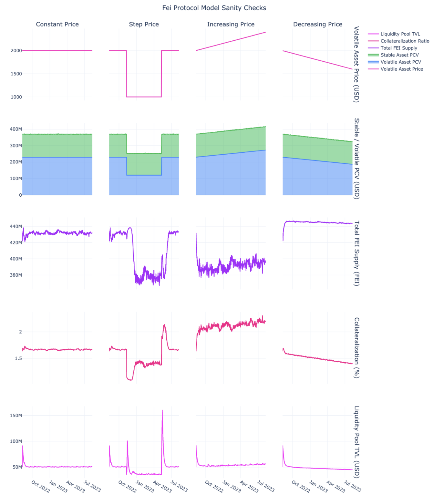
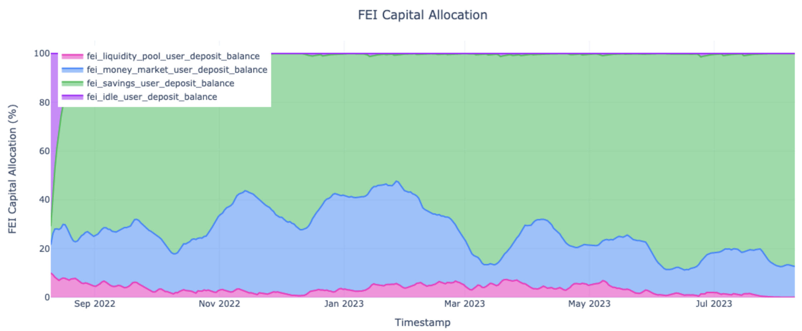
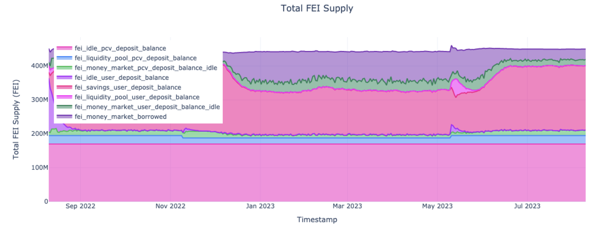
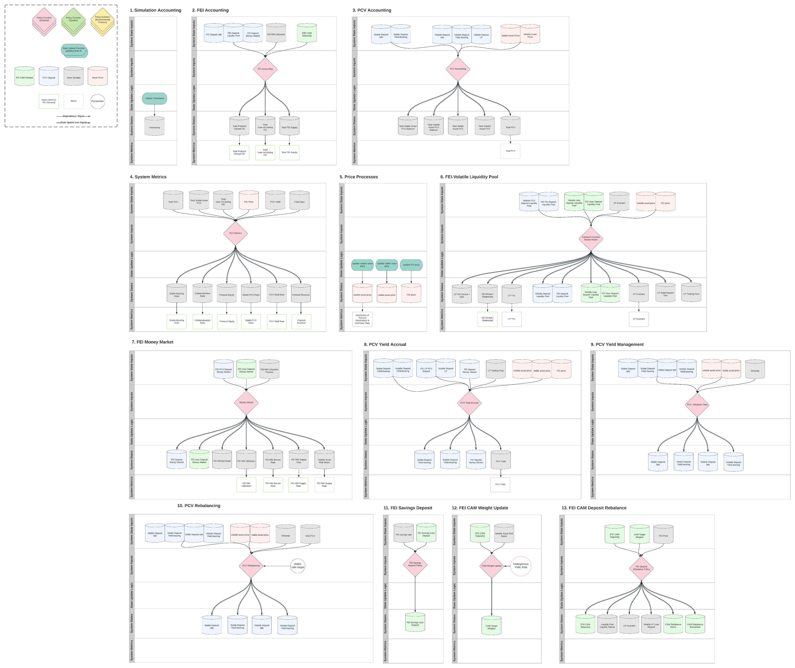

# [Fei Protocol Model](https://fei.money)
<!-- ALL-CONTRIBUTORS-BADGE:START - Do not remove or modify this section -->
[](#contributors-)
<!-- ALL-CONTRIBUTORS-BADGE:END -->

[](https://github.com/CADLabs/fei-protocol-model/actions/workflows/python.yml)

A modular dynamical-systems model of Fei Protocol's Protocol-controlled Value (PCV) Monetary Policy and proposed FEI Savings Rate mechanism, based on the open-source Python library [radCAD](https://github.com/CADLabs/radCAD).

This code repo is based on the [CADLabs Ethereum Economic Model](https://github.com/CADLabs/ethereum-economic-model) [radCAD](https://github.com/CADLabs/radCAD) modelling & simulation project template.

See the [Ethereum Economic Model README notebook](https://github.com/CADLabs/ethereum-economic-model/blob/main/experiments/notebooks/0_README.ipynb) for a good introduction to the radCAD experiment and modelling workflow.

Excerpts from [experiments/notebooks/1_sanity_checks.ipynb](experiments/notebooks/sanity_checks.ipynb):







## Table of Contents

* [Introduction](#Introduction)
  * [Model Features](#Model-Features)
  * [Directory Structure](#Directory-Structure)
  * [Model Architecture](#Model-Architecture)
  * [Model Assumptions](#Model-Assumptions)
  * [Differential Model Specification](#Differential-Model-Specification)
* [Environment Setup](#Environment-Setup)
* [Simulation Experiments](#Simulation-Experiments)
* [Model Extension Roadmap](#Model-Extension-Roadmap)
* [Tests](#Tests)
* [Change Log](#Change-Log)
* [Acknowledgements](#Acknowledgements)
* [Contributors](#Contributors-)
* [License](#License)

---

## Introduction

The Fei Protocol Model was developed to support public policy making and management of protocol risk and health.

The objectives for the model for each stakeholder group identified during requirements specification were:

**Stakeholder group 1: Fei Protocol Policy Makers**
- Inform public policy and decision making by evaluating simulated protocol health,
risk, resilience e.g. Contractionary Monetary Policy
- Inform effective management of PCV under different scenarios and failure modes
- Evaluate and sustainably increase demand for FEI

**Stakeholder group 2: Fei Holders**
- Obtain transparency and confidence as to the mechanics and resilience of the
system behind PCV management

**Stakeholder group 3: Tribe DAO**
- Better understand the levers impacting PCV management

From these requirements, three System Goals were developed:
- **Goal 1:** Sustainably increase demand for FEI
- **Goal 2:** Manage PCV risk
- **Goal 3:** Optimise PCV capital efficiency

Finally, the model aimed to achieve the following outcomes:
- Ability to make model-informed design decisions, illuminating complex relationships
and downstream effects
- Ability to support effective PCV management under different scenarios and failure
modes
- Ability to simulate FEI demand with different FEI Savings Rates under different
market conditions

A number of [assumptions](ASSUMPTIONS.md) were made in the scoping and development of the model, and any suggested extensions outside the scope of the MVP modelling effort have been proposed in the [modelling roadmap](ROADMAP.md). The following is a list of features currently implemented in the model:

### Model Features

* Ability to implement [PCV Management](model/parts/pcv_management.py) policies using a [PCV Deposit Class](model/types.py) with a familiar interface and standard methods for PCV movement and [yield accrual](model/parts/pcv_yield.py)
* A model of [User-circulating FEI Capital Allocation](model/parts/fei_capital_allocation.py) that describes the aggregate movements of user-circulating FEI within the Fei Protocol ecosystem [User Deposits](model/types.py) based on yield and risk weighted user preferences
* A generic [FEI-Volatile Liquidity Pool](model/parts/liquidity_pools.py) to model the dynamic of market condition dependent imbalances causing sourcing and sinking of FEI in the system
* A generic [Money Market](model/parts/money_markets.py) to model the FEI Savings Rate competing yield opportunity that exists for the FEI token
* Various [System Metrics and KPIs](model/parts/system_metrics.py) including PCV at Risk used to evaluate the performance of the system
* Various [Jupyter notebooks](#simulation-experiments) exploring relevant FIP monetary policy inspired analyses

### Directory Structure

* [data/](data/): Datasets and API data sources (such as Etherscan.io and Beaconcha.in) used in the model
* [docs/](docs/): Misc. documentation such as auto-generated docs from Python docstrings and Markdown docs
* [experiments/](experiments/): Analysis notebooks and experiment workflow (such as configuration and execution)
* [logs/](logs/): Experiment runtime log files
* [model/](model/): Model software architecture (structural and configuration modules)
* [tests/](tests/): Unit and integration tests for model and notebooks

### Model Architecture

The [model/](model/) directory contains the model's software architecture in the form of two categories of modules: structural modules and configuration modules.

#### Structural Modules

The model is composed of several structural modules in the [model/parts/](model/parts/) directory:

| Module | Description |
| --- | --- |
| [accounting.py](model/parts/accounting.py) | Assorted accounting of aggregate State Variables such as Protocol Owned FEI, User-circulating FEI, etc. |
| [fei_capital_allocation.py](model/parts/fei_capital_allocation.py) | Implementation of a model enconding user-circulating FEI movements |
| [fei_savings_deposit.py](model/parts/fei_savings_deposit.py) | Implementation of the FEI Savings Deposit |
| [liquidity_pools.py](model/parts/liquidity_pools.py) | Implementation of a generic Uniswap style FEI-Volatile Liquidity Pool |
| [money_markets.py](model/parts/money_markets.py) | Implementation of a generic Aave/Compound style Money Market |
| [pcv_management.py](model/parts/pcv_management.py) | Implementation of PCV management processes and strategies |
| [pcv_yield.py](model/parts/pcv_yield.py) | Implementation of PCV yield processes and strategies |
| [peg_stability_module.py](model/parts/peg_stability_module.py) | Implementation of a Fei Peg Stability Module for minting and redemption |
| [price_processes.py](model/parts/price_processes.py) | State update functions for drawing samples from misc. projected or stochastic asset price processes |
| [system_metrics.py](model/parts/system_metrics.py) | Assorted system metrics |
| [uniswap.py](model/parts/uniswap.py) | Uniswap style Constant Function Market Maker functions |

#### Configuration Modules

The model is configured using several configuration modules in the [model/](model/) directory:

| Module | Description |
| --- | --- |
| [constants.py](model/constants.py) | Constants used in the model, e.g. number of epochs in a year, Gwei in 1 Ether |
| [initialization.py](model/initialization.py) | Code used to set up the Initial State of the model before each subset from the System Parameters |
| [state_update_blocks.py](model/state_update_blocks.py) | cadCAD model State Update Block structure, composed of Policy and State Update Functions |
| [state_variables.py](model/state_variables.py) | Model State Variable definition, configuration, and defaults |
| [stochastic_processes.py](model/stochastic_processes.py) | Helper functions to generate stochastic environmental processes |
| [system_parameters.py](model/system_parameters.py) | Model System Parameter definition, configuration, and defaults |
| [types.py](model/types.py) | Various Python types used in the model, such as the `PCVDeposit` Class and calculation units |
| [utils.py](model/utils.py) | Misc. utility and helper functions |

### Model Assumptions

For a comprehensive list of modelling assumptions made see [ASSUMPTIONS.md](ASSUMPTIONS.md).

### Differential Model Specification

The [Differential Model Specification](https://lucid.app/lucidchart/3d7d90e2-582d-4054-9176-5019943965c5/edit) depicts the model's overall structure across System States, System Inputs, System Parameters, State Update Logic and System Metrics.

In addition to the LucidChart link above, a copy of the diagram has been included below, and there is a [PDF version](docs/diagrams/differential_specification_diagram_v4.pdf).



## Environment Setup

The following steps guide you through how to set up a custom development environment using Python 3 and Jupyter.

Please note the following prerequisites before getting started:
* Python: tested with versions 3.8, 3.9
* NodeJS might be needed if using Plotly with Jupyter Lab (Plotly works out the box when using the Anaconda/Conda package manager with Jupyter Lab or Jupyter Notebook)

First, set up a Python 3 [virtualenv](https://docs.python.org/3/library/venv.html) development environment (or use the equivalent Anaconda step):
```bash
# Create a virtual environment using Python 3 venv module
python3 -m venv venv
# Activate virtual environment
source venv/bin/activate
```

Make sure to activate the virtual environment before each of the following steps.

Secondly, install the Python 3 dependencies using [Pip](https://packaging.python.org/tutorials/installing-packages/), from the [requirements.txt](requirements.txt) file within your new virtual environment:
```bash
# Install Python 3 dependencies inside virtual environment
pip install -r requirements.txt
```

To create a new Jupyter Kernel specifically for this environment, execute the following command:
```bash
python3 -m ipykernel install --user --name python-cadlabs-fei --display-name "Python (CADLabs Fei Model)"
```

You'll then be able to select the kernel with display name `Python (CADLabs Fei Model)` to use for your notebook from within Jupyter.

To start Jupyter Notebook or Lab (see notes about issues with [using Plotly with Jupyter Lab](#Known-Issues)):
```bash
jupyter notebook
# Or:
jupyter lab
```

For more advanced Unix/macOS users, a [Makefile](Makefile) is also included for convenience that simply executes all the setup steps. For example, to setup your environment and start Jupyter Lab:
```bash
# Setup environment
make setup
# Start Jupyter Lab
make start-lab
```

### Known Issues

#### Plotly doesn't display in Jupyter Lab

To install and use Plotly with Jupyter Lab, you might need NodeJS installed to build Node dependencies, unless you're using the Anaconda/Conda package manager to manage your environment. Alternatively, use Jupyter Notebook which works out the box with Plotly.

See https://plotly.com/python/getting-started/

You might need to install the following "lab extension": 
```bash
jupyter labextension install jupyterlab-plotly@4.14.3
```

#### Windows Issues

If you receive the following error and you use Anaconda, try: `conda install -c anaconda pywin32`
> DLL load failed while importing win32api: The specified procedure could not be found.

## Simulation Experiments

The [experiments/](experiments/) directory contains modules for configuring and executing simulation experiments, as well as performing post-processing of the results.

The [experiments/notebooks/](experiments/notebooks/) directory contains Jupyter notebooks exploring each part of the model as well as generic data analysis and model validation.

### 1. Sanity Checks

See [experiments/notebooks/1_sanity_checks.ipynb](experiments/notebooks/sanity_checks.ipynb)

The purpose of this notebook is to perform a set of sanity checks that validate the expected key system dynamics, as well as the relationships between different key state variables. These analyses should also serve as an educational explanatory tool for less intuitive system dynamics and as an introduction to the model.

#### Analysis 1: System Dynamics Over Volatile Asset Price Trajectories

The purpose of this analysis is to illustrate and validate the driving influence of the Volatile Asset price on key system dynamics.

#### Analysis 2.1: State Variable Relationships

The purpose of this analysis is to illustrate and validate the relationships between and distribution of key system state variables using the model's default experiment initial state and system parameters.

#### Analysis 2.2: State Variable Correlation

The purpose of this analysis is to illustrate and validate the correlation between key system state variables.

#### Analysis 3: Liquidity Pool Dynamics

The purpose of this analysis is to illustrate and validate the effect of a step change in the Volatile Asset price on the liquidity pool imbalance, resulting minting and redemption, and capital allocation.

### 2. FEI Savings Rate Analyses

See [experiments/notebooks/2_fei_savings_rate.ipynb](experiments/notebooks/fei_savings_rate.ipynb)

The purpose of this notebook is to showcase how the radCAD Fei Protocol Model can leverage large-scale simulations to provide data-driven insights into monetary policy setting. Specifically, we’ll consider the development of a FEI Savings Rate according to existing FIPs, with relevant qualitative and probabilistic conclusions.

### 3. Protocol Controlled Value

See [experiments/notebooks/3_protocol_controlled_value.ipynb](experiments/notebooks/protocol_controlled_value.ipynb)

The purpose of this notebook is to illustrate and evaluate the effect of a target Stable Backing Ratio and Contractionary Monetary Policy applied to Liquidity Pool protocol-owned liquidity on key system dynamics and KPIs.

#### Analysis 1: FEI Volatile Liquidity Pool Leverage

This analysis serves to answer the what-if question: What leverage effect does protocol-owned liquidity have on total FEI supply and collateralization of the protocol in different market trends?

#### Analysis 2: PCV at Risk for Stable Backing Ratio Targets

The analysis serves to answer the what-if question: What effect does a PCV management strategy targetting a Stable Backing Ratio have on PCV at Risk and collateralization of the protocol? We'll statistically evaluate the efficacy of different policy settings.

### Historical Datasets

See [experiments/notebooks/historical_datasets.ipynb](experiments/notebooks/historical_datasets.ipynb)

The purpose of this notebook is to perform Exploratory Data Analysis of real Fei Protocol datasets using `checkthechain`.

### Liquidity Pools Notebook

See [experiments/notebooks/liquidity_pools_notebook.ipynb](experiments/notebooks/liquidity_pools_notebook.ipynb)

The purpose of this notebook is to illustrate the operation of the generic FEI-Volatile Liquidity Pool subsystem.

### Money Markets Notebook

See [experiments/notebooks/money_markets_notebook.ipynb](experiments/notebooks/money_markets_notebook.ipynb)

The purpose of this notebook is to illustrate the operation of the generic Money Market subsystem.

### PCV Management Notebook

See [experiments/notebooks/pcv_management_notebook.ipynb](experiments/notebooks/pcv_management_notebook.ipynb)

The purpose of this notebook is to illustrate PCV management strategies.

### PCV Yield Notebook

See [experiments/notebooks/pcv_yield_notebook.ipynb](experiments/notebooks/pcv_yield_notebook.ipynb)

The purpose of this notebook is to illustrate PCV yield accrual and management.

## Model Extension Roadmap

The modular nature of the model makes structural and experiment-level extensions straightforward. The [Model Extension Roadmap](ROADMAP.md) provides some inspiration.

## Tests

We use Pytest to test the `model` module code, as well as the notebooks.

To execute the Pytest tests:
```bash
source venv/bin/activate
python3 -m pytest tests
```

To run the full GitHub Actions CI Workflow (see [.github/workflows](.github/workflows)):
```bash
source venv/bin/activate
make test
```

### Simulation Profiling

A notebook exists to perform simulation time profiling of individual State Update Blocks of the model, see [experiments/notebooks/simulation_profiling/simulation_timestep_substep_profiling.ipynb]. Simulation time profiling of PRs is also performed in the GitHub Action pipeline, and included in each PR by a bot. See the Makefile and GitHub Action file for more details.

Memory profiling can also be performed using the `memory-profiler` Python package:

```bash
make profile-memory target="tests/test_notebook_memory.py 1_sanity_checks.ipynb"
```

## Change Log

See [CHANGELOG.md](CHANGELOG.md) for notable changes and versions.

## Acknowledgements

Storm and the rest of the Fei Protocol team for their close collaboration and guidance in creating this model.

## Contributors ✨

Thanks goes to these wonderful contributors (see [emoji key](https://allcontributors.org/docs/en/emoji-key)):
<!-- ALL-CONTRIBUTORS-LIST:START - Do not remove or modify this section -->
<!-- prettier-ignore-start -->
<!-- markdownlint-disable -->
<table>
  <tbody>
    <tr>
      <td align="center" valign="top" width="14.28%"><a href="https://github.com/cadlabsgt"><br /><sub><b>cadlabsgt</b></sub></a><br /><a href="https://github.com/CADLabs/fei-protocol-model/commits?author=cadlabsgt" title="Code">💻</a> <a href="https://github.com/CADLabs/fei-protocol-model/commits?author=cadlabsgt" title="Documentation">📖</a> <a href="#ideas-cadlabsgt" title="Ideas, Planning, & Feedback">🤔</a> <a href="#research-cadlabsgt" title="Research">🔬</a> <a href="https://github.com/CADLabs/fei-protocol-model/pulls?q=is%3Apr+reviewed-by%3Acadlabsgt" title="Reviewed Pull Requests">👀</a> <a href="#tutorial-cadlabsgt" title="Tutorials">✅</a></td>
      <td align="center" valign="top" width="14.28%"><a href="https://github.com/vmeylan"><br /><sub><b>vmeylan</b></sub></a><br /><a href="https://github.com/CADLabs/fei-protocol-model/commits?author=vmeylan" title="Code">💻</a> <a href="#ideas-vmeylan" title="Ideas, Planning, & Feedback">🤔</a> <a href="#research-vmeylan" title="Research">🔬</a> <a href="https://github.com/CADLabs/fei-protocol-model/pulls?q=is%3Apr+reviewed-by%3Avmeylan" title="Reviewed Pull Requests">👀</a></td>
    </tr>
  </tbody>
</table>

<!-- markdownlint-restore -->
<!-- prettier-ignore-end -->

<!-- ALL-CONTRIBUTORS-LIST:END -->

<!-- ALL-CONTRIBUTORS-LIST:START - Do not remove or modify this section -->
<!-- prettier-ignore-start -->
<!-- markdownlint-disable -->

<!-- markdownlint-restore -->
<!-- prettier-ignore-end -->

<!-- ALL-CONTRIBUTORS-LIST:END -->

This project follows the [all-contributors](https://github.com/all-contributors/all-contributors) specification. Contributions of any kind welcome!

## License

The code repository `CADLabs/fei-protocol-model` is licensed under the GNU General Public License v3.0.

Permissions of this strong copyleft license are conditioned on making available complete source code of licensed works and modifications, which include larger works using a licensed work under the same license. Copyright and license notices must be preserved. Contributors provide an express grant of patent rights.

If you'd like to cite this code and/or research, we suggest the following format:

> CADLabs, Fei Protocol Model, (2023), GitHub repository, https://github.com/CADLabs/fei-protocol-model

```latex
@misc{CADLabs2023,
  author = {CADLabs},
  title = {Fei Protocol Model},
  year = {2023},
  publisher = {GitHub},
  journal = {GitHub repository},
  howpublished = {\url{https://github.com/CADLabs/fei-protocol-model}},
  version = {v0.1.1}
}
```
